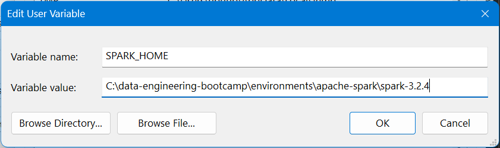
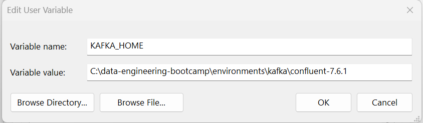

# Data Engineering Bootcamp

## Prerequisites

1. Download Git Bash
2. Download 7Zip

## Environment Setup

1. Open Git Bash
2. Execute the below commands
   ```
   $> cd c:
   $> git clone https://github.com/naveenpn-trainer/data-engineering-bootcamp.git
   ```
3. Navigate to C:\data-engineering-bootcamp and double click **init-setup.bat**
4. Right click environments.zip --> Select 7Zip ->  and Extract Here
5. Right click softwares.zip --> Select 7Zip ->  and Extract Here

   ```
   data-engineering-bootcamp/
   │
   ├── environments/
   ├── data-engineering-lab/
   ├── projects/
   ```
# Configure Environment Variables

## Apache Spark




## Confluent Kafka



## Python Environment Setup

* Python
* VS Code
